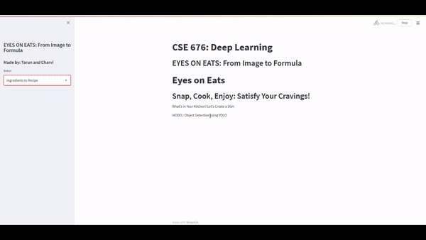

# F.E.A.S.T - Food & Ingredient AI Suggestion Technology

## Team Members

-   **Charvi Kusuma** [GitHub](https://github.com/kcharvi)
-   **Tarun Reddi** [GitHub](https://github.com/REDDITARUN)

## What's This Project and How Is It Used?

FEAST, short for Food & Ingredient AI Suggestion Technology, is an innovative project designed to assist individuals in meal planning and preparation by leveraging advanced deep learning techniques. The project employs object detection and text generation models to analyze images of ingredients and generate personalized recipes based on the detected ingredients. This system aims to minimize food waste, optimize meal planning, and enhance the overall cooking experience.

## How Can This Project Transform Food Delivery Apps Like Uber Eats and DoorDash?

FEAST can significantly enhance food delivery apps by offering personalized meal suggestions based on the ingredients users have at home. By integrating FEAST, apps like Uber Eats and DoorDash can:

-   Provide users with meal options that complement their existing pantry items, encouraging users to order specific ingredients they lack.
-   Suggest healthier meal alternatives by identifying available ingredients and recommending balanced recipes.
-   Enhance user engagement through personalized meal planning features, potentially increasing order frequency and customer satisfaction.

## Benefits from a Consumer Point of View

From a consumer's perspective, FEAST offers several advantages:

-   **Personalized Recipes**: Users receive customized meal suggestions tailored to the ingredients they have, reducing the time spent deciding what to cook.
-   **Reduced Food Waste**: By utilizing available ingredients, users can minimize food wastage.
-   **Cost Savings**: Encourages home cooking with available ingredients, potentially lowering the frequency of takeout orders.
-   **Convenience**: Simplifies the meal planning process, making it easier for users to prepare meals without extensive planning.

## General Overview of the Project

FEAST integrates object detection and text generation to create a seamless user experience:

1. **Image Analysis**: Users upload images of their ingredients.
2. **Object Detection**: The system identifies and labels the ingredients using trained YOLO models.
3. **Recipe Generation**: A transformer model generates recipes based on the detected ingredients.
4. **User Interaction**: The generated recipes are presented to the user through application.

## Dataset Overview

The project uses two types of datasets:

1. **Object Detection Data**: Collected through web scraping using the Bing image downloader, including images of 100 different ingredients, each class containing 50 images.
2. **Text Generation Data**: The RecipeNLG dataset, encompassing over 2 million recipes, including titles, ingredients, directions, links, and Named Entity Recognition (NER) labels.

## Data Preprocessing

The preprocessing steps include:

1. **Data Cleaning**: Ensuring consistency in image formats and directory names.
2. **Data Augmentation**: Augmenting underrepresented classes to ensure uniformity.
3. **Annotation**: Automating the annotation process using Grounding DINO for object detection.
4. **Tokenization**: Tokenizing the recipe data for text generation using the BART tokenizer.

## Object Detection Models Trained Here

The project trained multiple versions of YOLO models:

1. **YOLO_v7_Version_1**
2. **YOLO_v7_Version_2**
3. **YOLO_v7_Version_3**
4. **YOLO_v9_Version_1**
5. **YOLO_v9_Version_2**

## Results Table

### YOLO V7 Evaluation

| Version   | Precision | Recall | mAP@0.5 |
| --------- | --------- | ------ | ------- |
| Version 1 | 0.528     | 0.504  | 0.527   |
| Version 2 | 0.526     | 0.49   | 0.547   |
| Version 3 | 0.607     | 0.476  | 0.557   |

### YOLO V9 Evaluation

| Version   | Precision | Recall | mAP@0.5 |
| --------- | --------- | ------ | ------- |
| Version 1 | 0.416     | 0.391  | 0.394   |
| Version 2 | 0.477     | 0.438  | 0.461   |

## Transformer Model Used Here

The project initially used the BART transformer model for text generation but switched to the ChefTransformerT5 from Hugging Face due to overfitting issues with the BART model.

## Challenges Faced and How Overcome

1. **Inconsistent Data Formats**: Resolved by standardizing image formats and directory names.
2. **Data Augmentation**: Addressed underrepresented classes through augmentation techniques.
3. **Annotation Difficulties**: Automated the process using Grounding DINO for efficient annotation.
4. **Model Overfitting**: Switched to a pre-trained model, ChefTransformerT5, to overcome overfitting issues in text generation.

## Glimpse of the Locally Deployed Application

The locally deployed application, developed using Streamlit, allows users to upload images of ingredients and receive generated recipes. Below is working video showcasing the application's functionality, including ingredient detection and recipe generation.

## References

1. Anil, A. K. "GroundingDino Auto-Annotation." GitHub Repository. [GroundingDino Auto-Annotation](https://github.com/anil2k/groundingdino-auto-annotation)
2. Gaurav, G. "Bing Image Downloader." GitHub Repository. [Bing Image Downloader](https://github.com/gurugaurav/bing_image_downloader/tree/master)
3. Hugging Face. "T5 Recipe Generation." [Flax Community](https://huggingface.co/flax-community/t5-recipe-generation)

### 🚨Academic Integrity Disclaimer🚨

This project in this repository is intended solely as an inspiration for your future projects and should be referenced accordingly. It is not meant for students to fulfill their academic project requirements. If a student uses this project for such purposes, the creators are not responsible. The student will be solely accountable for violating academic integrity. We explicitly state that this repository should not be used to meet academic requirements. Therefore, any academic integrity issues should be addressed with the student, not the creators.
